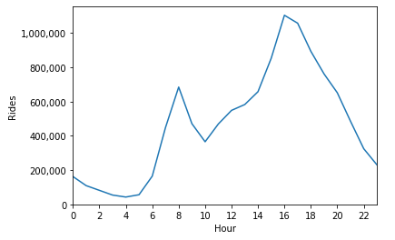
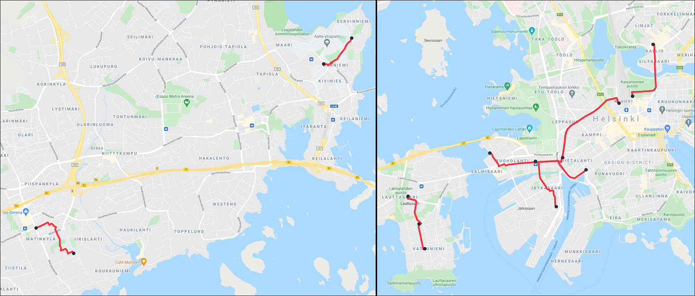

This is an upload of an old project from 2021.


----

# A Look Into Greater Helsinki's City Bike Usage Between 2016-2020 <a name="introduction"></a>
Using data obtained from [HSL's open data directory](https://www.hsl.fi/en/hsl/open-data), an exploration of the usage of city bikes in Helsinki and 
Espoo was conducted. The analysis seeks to address three key questions:
1. What areas and hours are the busiest?
2. What are city bikes used for?
3. What factors affect the popularity of city bikes?

The motivation for this study stemmed from a curiosity about how city bikes are utilized within Greater Helsinki. 
City bikes have increasingly become a vital part of urban transportation systems, offering sustainable and flexible 
mobility options. By analyzing the usage data of city bikes, the goal was to uncover patterns and insights that could 
explain why the city bike network is set up the way it is.

Additionally, this project was selected to try out data engineering techniques and working with locational data.

**Keywords: Geocoding, GCP, Data Engineering, Data Science**

## Table of Contents

1. [Introduction](#introduction)
2. [Gathering the Data](#gathering-the-data)
3. [Results](#results)
    - [City Center is the Busiest](#city-center-is-the-busiest)
    - [Most Common Routes Are Close to Public Transportation](#most-common-routes)
4. [Key Issues With the Data](#key-issues-with-the-data)

## Gathering the Data <a name="gathering-the-data"></a>
HSL, the company behind public transportation in Greater Helsinki, hosts 1.1 gigabytes (12.2 million rows) worth of
data openly. Each month has its own file and each year consisted of a directory. The files were recursively read using
the `glob` module and concatenated into a `pd.DataFrame` for further processing. 

The raw data was structured as follows:

```bash
HSLdata
   ├── od-trips-2016
   │   ├── 2016-05.csv
   │   ├── 2016-06.csv
   │   ├── 2016-07.csv
   │   ├── 2016-08.csv
   │   ├── 2016-09.csv
   │   └── 2016-10.csv
   ├── od-trips-2017
   │   ├── 2017-05.csv
   │   ├── 2017-06.csv
   │   ├── 2017-07.csv
   │   ├── 2017-08.csv
   │   ├── 2017-09.csv
   │   └── 2017-10.csv
   ├── od-trips-2018
   │   ├── 2018-04.csv
   │   ├── 2018-05.csv
   │   ├── 2018-06.csv
   │   ├── 2018-07.csv
   │   ├── 2018-08.csv
   │   ├── 2018-09.csv
   │   └── 2018-10.csv
   ├── od-trips-2019
   │   ├── 2019-04.csv
   │   ├── 2019-05.csv
   │   ├── 2019-06.csv
   │   ├── 2019-07.csv
   │   ├── 2019-08.csv
   │   ├── 2019-09.csv
   │   └── 2019-10.csv
   └── od-trips-2020
       ├── 2020-03.csv
       ├── 2020-04.csv
       ├── 2020-05.csv
       ├── 2020-06.csv
       ├── 2020-07.csv
       ├── 2020-08.csv
       ├── 2020-09.csv
       └── 2020-10.csv

```

## Results <a name="results"></a>
The findings from this exploration are presented below without the code. The Python notebook is available as a part of this
repository for those interested *(please note that the code remains in its original 2021 state and may not reflect
current capabilities)*.

### City Center is the Busiest <a name="city-center-is-the-busiest"></a>
<p align="center">
  
</p>

<!--

-->

The city center emerges as the busiest area for city bike usage, as illustrated by the heatmap. Larger clusters can 
also be seen near areas that are well-supported by public transportation or have larger concentrations of population. 
A prominent example of this is Leppävaara, Espoo. It acts as major transportation hub for the area, accepting both 
intercity and commuter train traffic in addition to several trunk line buses passing through it.
Finland's third-largest shopping centre, Sello, can also be found there alongside plethora of other services making it
an enticing place for consumers. Leppävaara itself is surrounded by several smaller city bike hotspots comprising mostly
of residential areas. Given the circumstances it is likely that the popularity of the city bike service in this area is
explained by people using the bikes to ride relatively short distances from their homes to the center of Leppävaara to access
services and further transportation. In a similar fashion people coming from outside to Leppävaara are using the bikes
to get home faster.

Interestingly, Finland's 6th largest shopping center, Itis, located north-east of Herttoniemi,
does not exhibit a similarly intensive hotspot. This contrast may stem from the area's residential layout. 
Whereas Leppävaara is quite densely packed around Sello, Itäkeskus is more sparsely developed and features wide,
multi-lane roads and expansive intersections next to the shopping center which can be inconvenient for pedestrians
and light traffic alike.

The concentrated red zones around Helsinki center can be attributed to high population density, extensive public 
transportation use, and a dense network of city bike stations. The first two points repeat throughout the
analysis but having access to a larger amount of stations is a big factor for city bike usage. It enables easier route 
planning and, therefore, lowers the barrier to choosing a city bike over another mode of transportation.

Otaniemi sparks interest with its notable red spot in the heatmap. This peninsula is primarily inhabited by university 
students due to Aalto University being located in the area. The main hotspot is near the entrance to Aalto University metro station
while the spots to the east are at on-campus student housing bicycle stations. Further analysis reveals that the short
trip between student housing and the nearest services alongside the university itself is actually one of the most
common routes ridden by the service's users.

<br>
<p align="center">
  
</p>

<!--

-->

Analysing the amount of trips taken each hour during the five years reveals a pattern that aligns with typical 
expectations. There are two major peaks during the morning and evening rush hours, with the latter extending slightly
into the evening as leisure traffic increases. If one wants to be sure that there is bike available, they should go for
a ride at 4 in the morning as that was the quietest hour between 2016 and 2020. From an operational standpoint, these
distinct peaks pose capacity challenges. Having enough bicycles to cover the demand that arises at 16-18 results in a
considerable amount of idle bicycles during the remaining 22 hours of the day. Moreover, it's important to note that 
the data only includes successful trips, meaning instances where enough bicycles were available. Therefore, the actual 
demand could potentially be higher than depicted here.

### Most Common Routes Are Close to Public Transportation <a name="most-common-routes"></a>
<br>
<p align="center">
    
</p>

The already familiar pattern repeats itself: the most frequented stops are located near other modes of public 
transportation. For instance, *Itämerentori* is adjacent to Ruoholahti metro station, *Töölönlahdenkatu* and 
*Rautatientori* are on the premises of the central railway station, and *Ympyrätalo* serves Hakaniemi's metro station. 
Conversely, the least used stations tend to be those that are either newly established or decommissioned. Derby Business
Park, located in Vermonniitty — an area still under construction — and the new apartment complexes on Mestarinkatu
exemplify this trend.

<br>
<p align="center">
  
</p>

In the case of *Leiritori*, the station was originally positioned in a small residential area also served by a few other
nearby stations. Due to low demand, it was relocated after the 2018 season, recording only about 400 departures and 
returns combined during its operational period. When investigating the usage levels of stations, it is important to 
compare the statistic on a yearly level to ensure that decisions made regarding future bicycle station placements are
relevant. This approach prevents long-standings stations from skewing the results and provides comparable data for
evaluating new stations. Further analysis could explore the annual averages across all stations to identify ones
consistently performing on the extreme ends of the scale. 




The image above provides a visual representation of how city bikes are utilized for accessing other forms of 
transportation. It displays the 10 most frequented routes, all of which lead either to a metro station or the 
central railway station. The other ends are at residential areas or near offices. Notably, the previously discussed
short journey between student housing and Aalto University metro station is among the 10 most popular routes. The 
showcased routes also share the fact that they are less than two kilometers long, emphasising the point of city 
bikes being used to quickly cover short distances.

## Key Issues With the Data <a name="key-issues-with-the-data"></a>
The data provided contained some factors that affected the results of the analysis. Notably, some ride were
inaccurately recorded. To illustrate, the dataset contained trips that covered multiple kilometers despite lasting only
seconds, resulting in absurdly high average speeds. It proved challenging to distinguish a realistic ride from an
erroneous given that each rider has their own physical capabilities. Consequently, an analysis of top speeds and 
averages was omitted. The anomalous journeys were retained in the dataset for the purposes of analysing destinations 
as erroneous logging of speed or distance does not affect the statistic. This comes with the assumption that the 
bikes log ride metrics separately from the stations, and as such, not all data would be misleading.

Another significant consideration is the 30-minute ride limit per session, after which users incur additional charges. 
As a result, it becomes troublesome to analyse longer sessions as an hour-long trip is likely split into two or three 
shorter ones with their own starting and ending places. For the purposes of this study, these would be considered 
individual, independent rides rather than a single longer ride.